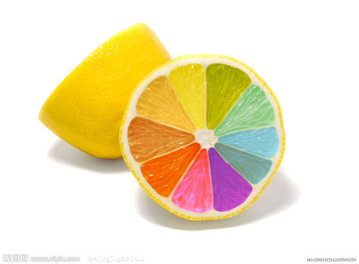

@#:{4c3526529c445073ffa5319f48436628}#@
# 一号标题
## 二号标题
### 三号标题
#### 四号标题

任务是日常生活中，通常指交派的工作，担负的职责、责任。在众多游戏中，有目的的指引玩家进行游戏活动，并给予玩家一定奖励的手段，即为游戏任务。

```
var marked = require('marked');
console.log(marked('I am using __markdown__.'));
// Outputs: <p>I am using <strong>markdown</strong>.</p>
```

表格标题1|表格标题2
---|---
内容1|内容2
内容3 | 内容4

_斜体文字_

__加粗文字__

___加粗斜体文字___

行内代码```var i = 123;```

~~删除文本~~

[链接文本](http://baidu.com)

### 示例图片


# Heading One
## Heading Two
### Heading Three
#### Heading Four

highlight.js. Syntax highlighting for the Web ... multi-language code highlighting; available
for node.js; works with any markup; compatible with any js framework ... modes across all languages;
CSS .class selectors relevance was dropped to prevent wrong ... ES6 features in JavaScript are better
supported now by Gu Yiling.

## Demo sections

@inline: inline demo one @
@page: page demo one@

@inline: inline demo two @
@page: page demo two@

## Repeated demo sections

@inline: inline demo one / section 2 @
@page: page demo one/hello world@