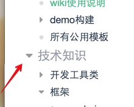
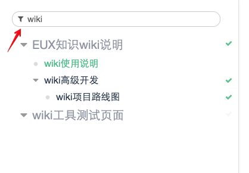
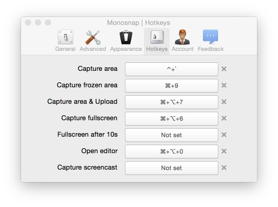
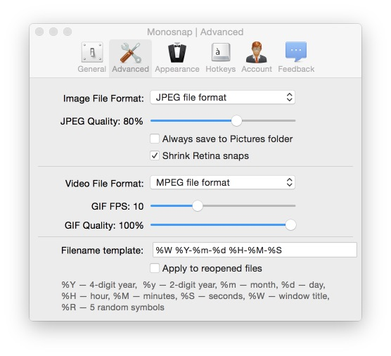
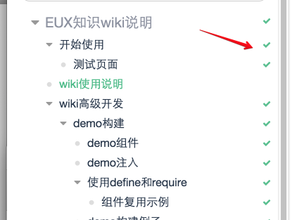
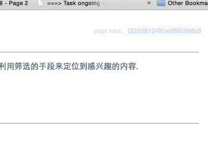

@#:{2253612491e2685566c9f58e08cda267}#@

# wiki 侧边栏

wiki 侧边栏是wiki中所有内容的关健导航方式. 其中包括有基础的使用方式, 以及利用筛选的手段来定位到感兴趣的内容.

@todo: 未来考虑如何解决wiki无限扩容的情况, 以及更高效有效的搜索方式.

## 基础使用

### 展开与收缩

阅读时, 具有子内容的页面, 可以很容易的进行收缩和展开, 从而保持一个更加清洁的导航视图.

通过点击这些三角符号, 则能收缩展开.



同时, 我们还记忆上一次操作的收缩展开状态, 在下一次重载页面时再次读出上次状态.

## 页面筛选

随着知识沉淀增加, 我们的内容会越来越充实, 这也意味着找信息会越来越苦逼.
大救星就是页面筛选啦.

通过在这个输入框中输入筛选的关键词, 可以快速的定位页面.



*为嘛叫 "筛选" 呢? 没错~! 我们未来可能会有更强大的内容搜索功能! 请四目以待 XD*

## 快速截图

### Mac中的流程

安装这个非常好的截图程序 [Monosnap](http://monosnap.com/en/page/download/mac)

安装好之后, 记得设置一个 "区域截图" 的快捷键, 这个是非常常用的功能, 例如我给了一个非常简单的全局快捷键 `ctrl + <tilt>`.



为了让空间更可控, 推荐将monosnap的图片格式设置成 `jpg`



然后, 将图片放到相应的位置, 你就可以愉快的用markdown格式来引用它了.

```
-- a-page
  |-- abc.jpg
  |-- a-page.md

# inside a-page.md

```

### windows中的流程

@todo: 谁来填填坑?

# wiki 阅读进度

读东西有个东西很重要, 就是阅读的已读和未读状态.

eux-lab wiki中, 我们默认提供一个简单的已读进度提示. 在侧边栏中的右侧, 你可以看到很多勾勾, 绿勾则代表着这个页面你曾经访问过.
当然, 它现在还只是用访问与否来判断已读与否, 未来可以考虑 -
@todo: 使用更可靠的方式来判断页面的已读状态.




# 页面快速定位

有时, 你会觉得在Webstorm或sublime等编辑器中定位一个页面有些困难.
这种情况下, 可以考虑使用page key的功能来快速定位.

每个页面顶部都会有一个相对唯一的key, 即为这个页面的标识. 打开页面后, 你可以在右上角看到一个半透明的文本框.



鼠标悬浮之后, 文本框会自动选中里面的内容, 这时可以快速的复制这个page key.

然后, 切换到文本编辑器里, 全局搜索这个page key, 即可快速的定位到你感兴趣的页面.